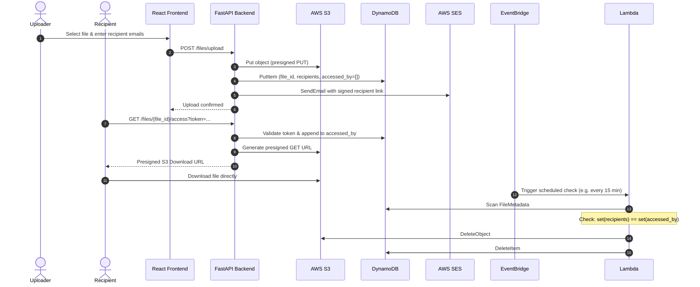

# Architecture Diagrams

## System Overview

```
┌─────────────┐        ┌──────────────┐        ┌──────────────┐
│ React (TS)  │──REST──▶  FastAPI      │──boto3──▶  AWS S3      │
│ frontend    │◀───────│  backend      │◀────────│  (file store)│
└─────────────┘        └──────┬───────┘        └──────────────┘
                                │
                                ├──────────────▶ DynamoDB
                                │                (FileMetadata table)
                                │
                                └──────────────▶ AWS SES
                                                 (recipient emails)

                        ┌──────────────┐
                        │ EventBridge  │  (scheduled trigger, e.g. every 15 min)
                        │  schedule    │
                        └──────┬───────┘
                                ▼
                        ┌──────────────┐
                        │ Lambda       │  scans DynamoDB, compares
                        │ (deletion)   │  recipients vs accessed_by,
                        └──────┬───────┘  deletes from S3 + DynamoDB
                                ▼
                        ┌──────────────┐
                        │ S3 + DynamoDB│
                        └──────────────┘
```

## Lifecycle Sequence


